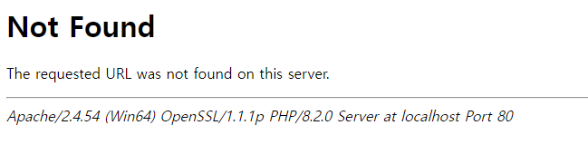

# 커스텀 에러 페이지
## 만든 목적
그저 밍밍한 에러 페이지를 깔끔하게 보이기 위해 만들었습니다.



이 멋없는 디자인 대신


이렇게 바꿔보면 어떨까요?

## 바꾸는 방법
1. [릴리즈 페이지](https://github.com/gaon12/CustomErrorPages/releases)에서 CustomErrorPages_버전명.zip을 다운로드 받습니다.
2. 서버 루트 폴더에 error 폴더를 생성 후 다운로드 받은 압축파일을 error 폴더 안에 압축 해제합니다.
3. Apache2의 경우 서버 루트에 있는 .htaccess 파일(없으면 생성)을 다음과 같이 수정합니다.
```htaccess
<IfModule mod_rewrite.c>
    RewriteEngine On

    # 지정된 에러 코드에 대한 처리
    ErrorDocument 400 /error/400
    ErrorDocument 401 /error/401
    ErrorDocument 403 /error/403
    ErrorDocument 404 /error/404
    ErrorDocument 500 /error/500
    ErrorDocument 502 /error/502
    ErrorDocument 503 /error/503

    # 그 외 오류 처리
    ErrorDocument 404 /error

    # /error/에러코드 경로를 리액트 앱으로 리다이렉트
    RewriteCond %{REQUEST_URI} ^/error/ [NC]
    RewriteRule . /index.html [L]
</IfModule>
```

Nginx의 경우에는 서버 설정 파일에 다음 설정을 추가합니다.

```conf
server {
    # ... 기타 설정들

    # 지정된 에러 코드에 대한 처리
    error_page 400 /error/400;
    error_page 401 /error/401;
    error_page 403 /error/403;
    error_page 404 /error/404;
    error_page 500 /error/500;
    error_page 502 /error/502;
    error_page 503 /error/503;

    # 그 외 오류 처리
    error_page 404 /error;

    location / {
        try_files $uri $uri/ /index.html;
    }
}
```

이후 Nginx를 재시작합니다.

# 기여
언제나 기여는 환영입니다!

# 라이선스
[MIT 라이선스](https://github.com/gaon12/CustomErrorPages/blob/main/LICENSE)로 배포됩니다.